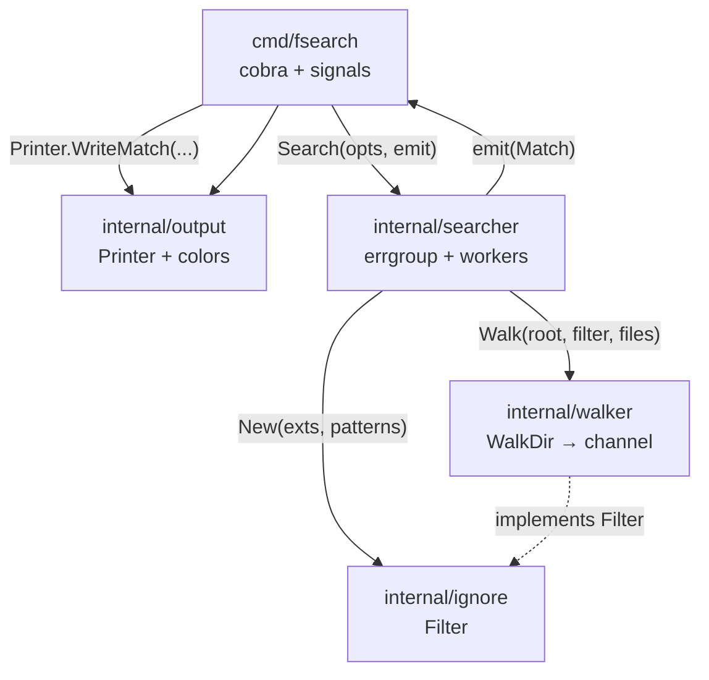
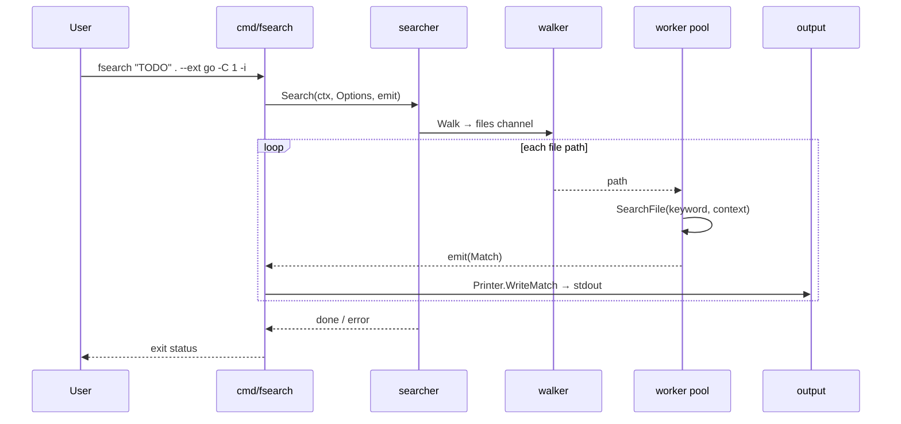
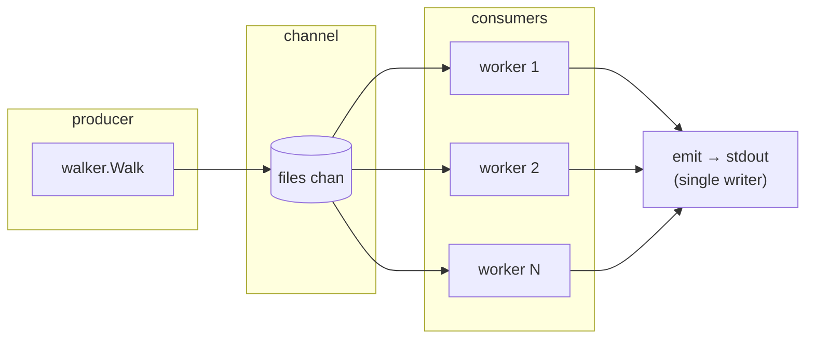

# fsearch

Fast recursive file content search for the Linux shell.

Modern, concurrent alternative to classic `grep` / `find` combos.

> **Status:** Sprint 5 — documentation & release (README polish, advanced help, final review).

## Quick start

```bash
make build
./bin/fsearch "TODO" . --ext go,md -C 1 -i
```

That builds the binary, then searches for `TODO` under the current directory (Go and Markdown only, one line of context, case-insensitive).

See [Install (Linux)](#install-linux) and [Usage](#usage) for more options.

## Requirements

- Go 1.25+ (module line in `go.mod`; tested with Go 1.26)
- Linux

## Build

```bash
make build
# or
go build -o bin/fsearch ./cmd/fsearch
```

## Install (Linux)

### From module (no clone)

```bash
go install github.com/nick/fsearch/cmd/fsearch@latest
```

Ensure the install directory is on your `PATH`:

```bash
# Default install location is $(go env GOPATH)/bin, unless GOBIN is set
export PATH="$(go env GOPATH)/bin:$PATH"
# or, if you set GOBIN:
# export PATH="$(go env GOBIN):$PATH"

fsearch --help
```

### From a local clone

```bash
make install
# or
go install ./cmd/fsearch
```

### Copy a built binary

```bash
make build
sudo cp bin/fsearch /usr/local/bin/
# or without sudo, e.g. ~/bin if that directory is on PATH
cp bin/fsearch ~/bin/
```

## Usage

### Basics

```bash
fsearch --help

# Search for a keyword under the current directory
./bin/fsearch "TODO" .

# Everyday combo: extensions, context, case-insensitive
./bin/fsearch "TODO" . --ext go,md -C 1 -i
```

### Filter files

```bash
# Only Go and Markdown files
./bin/fsearch "TODO" . --ext go,md

# Extra basename ignores (repeatable)
./bin/fsearch "FIXME" ./internal --ignore vendor --ignore '*.min.js'

# Skip loading root .gitignore (built-in skips and --ignore still apply)
./bin/fsearch "TODO" . --no-gitignore
```

Root `.gitignore` is loaded automatically when present (root file only; MVP rule subset — see [Known limitations](#known-limitations)).

### Match options

```bash
# Case-insensitive
./bin/fsearch "todo" . -i

# One line of context before/after each hit
./bin/fsearch "TODO" . --ext go -C 1

# Regex (Go RE2); combine with -i for case-insensitive patterns
./bin/fsearch 'TODO|FIXME' . --ext go -e
./bin/fsearch 'todo' . -e -i
```

### Output & speed

```bash
# Force plain text (also automatic when piped / NO_COLOR)
./bin/fsearch "TODO" . --no-color

# NDJSON (one JSON object per match; good for pipes / jq)
./bin/fsearch "TODO" . --ext go --json
./bin/fsearch "TODO" . --ext go -C 1 --json

# Disable stderr progress (also off when stderr is not a TTY or with --json)
./bin/fsearch "TODO" . --no-progress

# Limit concurrent file-search workers (0 = NumCPU)
./bin/fsearch "TODO" . --workers 4
```

### Output format

Hits are grep-style: `path:line:content`

With context (`-C N`):

```
path-line-before
path:line:hit content
path-line-after
--
path:line:next hit
```

Overlapping or adjacent context groups on the same file are coalesced (no
duplicate lines, no mid-group `--`), like grep.

On a TTY, path is magenta, line numbers green, and the keyword (or regex span)
is bold red on hit lines. Colors are off when piped, when `NO_COLOR` is set, or
with `--no-color`.

**JSON (`--json`):** one NDJSON object per match on stdout (no ANSI, no `--`
coalescing). Shape:

```json
{"path":"main.go","line":3,"content":"// TODO here"}
{"path":"a.txt","line":2,"content":"HIT","before":["before"],"after":["after"]}
```

`before` / `after` are omitted when empty. Context from `-C` is still included
on each object when present.

**Progress:** when stderr is a TTY (and not `--json` / `--no-progress`), a
updating line shows file and match counts, e.g. `fsearch: 128 files, 4 matches`.

Unreadable paths during walk or file open are skipped; a warning goes to stderr
(`fsearch: skip <path>: …`) and the search continues.

| Flag | Meaning |
|------|---------|
| `--ext go,md` | only these extensions (empty = all) |
| `--ignore PAT` | skip basenames matching PAT (exact or glob; repeatable) |
| `-i`, `--ignore-case` | case-insensitive search (default: case-sensitive) |
| `-C`, `--context N` | N lines of context before and after each match |
| `-e`, `--regex` | treat keyword as a Go RE2 regular expression |
| `--json` | emit one NDJSON object per match on stdout |
| `--workers N` | concurrent file-search workers (`0` = `NumCPU`, default) |
| `--no-gitignore` | do not load root `.gitignore` |
| `--no-color` | disable colored output |
| `--no-progress` | disable progress indicator on stderr |

### Known limitations

- **Root `.gitignore` only** — only `Root/.gitignore` is loaded (no nested `.gitignore`). Rules are an MVP subset: `#` comments, `!` negation (last match wins), trailing `/` (directories only), leading `/` (anchored to root), and basic globs via `filepath.Match`. Not full git semantics (no `**` parity, escaped spaces, etc.).
- **Built-in directory skips always apply** — common junk dirs (e.g. `.git`, `node_modules`, `vendor`, `bin`, build/cache/IDE dirs) are pruned even when `.gitignore` is absent or `--no-gitignore` is set. They are separate from `--ignore`. There is no flag to disable the defaults.
- **Match order** across files is not sorted; hits stream as workers finish. Matches from a single file stay in line order and contiguous for context coalescing.
- **Binary skip** — files with a NUL byte in the first 8KiB are not searched.

## Develop

```bash
make test
make cover
make bench          # searcher benchmarks (override: BENCH=BenchmarkSearch BENCHTIME=2s)
make clean
```

### Benchmarks (sample)

Fixture (built once per benchmark): **50** `.go` files × **200** lines, a `TODO` hit every 20th line.

Sample run (`make bench`, Go test `-benchmem -benchtime=1s` on linux/amd64, Intel i5-1335U):

| Benchmark | ns/op | B/op | allocs/op |
|-----------|------:|-----:|----------:|
| `BenchmarkSearch` | ~1.84ms | ~3.6 MiB | ~10.7k |
| `BenchmarkSearchWithContext` (`-C 1`) | ~2.43ms | ~4.1 MiB | ~12.0k |

Numbers vary by CPU, GOMAXPROCS, and load. Re-run with `make bench` for local results. Raw example:

```text
BenchmarkSearch-12                 739   1837607 ns/op  3621331 B/op  10717 allocs/op
BenchmarkSearchWithContext-12      445   2426592 ns/op  4102694 B/op  12017 allocs/op
```

## Project structure

```
fsearch/
├── cmd/fsearch/
│   └── main.go              # Cobra CLI entrypoint (flags, args, Ctrl+C)
├── internal/
│   ├── searcher/            # Orchestrates walk + concurrent file matching
│   ├── walker/              # filepath.WalkDir → file path channel
│   ├── ignore/              # Extension allow-list + basename skip rules
│   └── output/              # Grep-style, colors, NDJSON
├── bin/                     # Built binary (make build)
├── Makefile
├── go.mod / go.sum
├── README.md
├── AGENTS.md                # Agent/dev rules
└── DEVELOPMENT_PLAN.md      # Sprint plan
```

| Package | Role |
|---------|------|
| `cmd/fsearch` | Parses CLI args/flags, wires options, streams matches to stdout |
| `internal/searcher` | Coordinates workers; opens files and finds keyword/regex hits by line |
| `internal/walker` | Walks the tree (skips symlinks); yields regular file paths |
| `internal/ignore` | Default dir skips (`.git`, `node_modules`, …) + `--ext` / `--ignore` |
| `internal/output` | Formats hits (context, colors, regex highlight, NDJSON) |

### Architecture

Packages stay small and one-way: the CLI depends on `searcher` and `output`; `searcher` depends on `walker` and `ignore`. Nothing under `internal/` imports `cmd/`.



### Search data flow

A single invocation walks the tree once, fans file paths out to N workers (default: CPU count), and prints matches as they arrive (order is not guaranteed).



### Concurrency model



1. **Producer** — one goroutine walks the tree and pushes paths into a buffered channel.
2. **Consumers** — `Workers` (or `runtime.NumCPU()`) goroutines read paths, scan file contents, and emit matches.
3. **Cancel** — `context` from Ctrl+C stops the walk and workers via `errgroup`.
4. **Emit** — a single consumer goroutine writes matches to stdout (line-safe without a mutex).

## Docs

- [AGENTS.md](AGENTS.md) — agent/dev rules
- [DEVELOPMENT_PLAN.md](DEVELOPMENT_PLAN.md) — sprint plan
