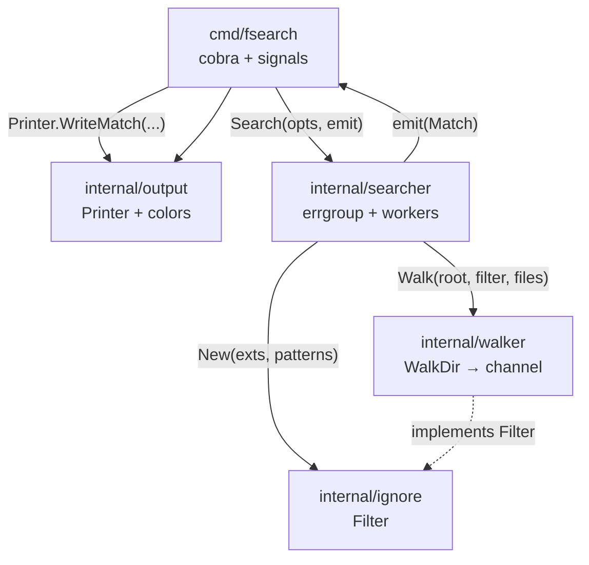
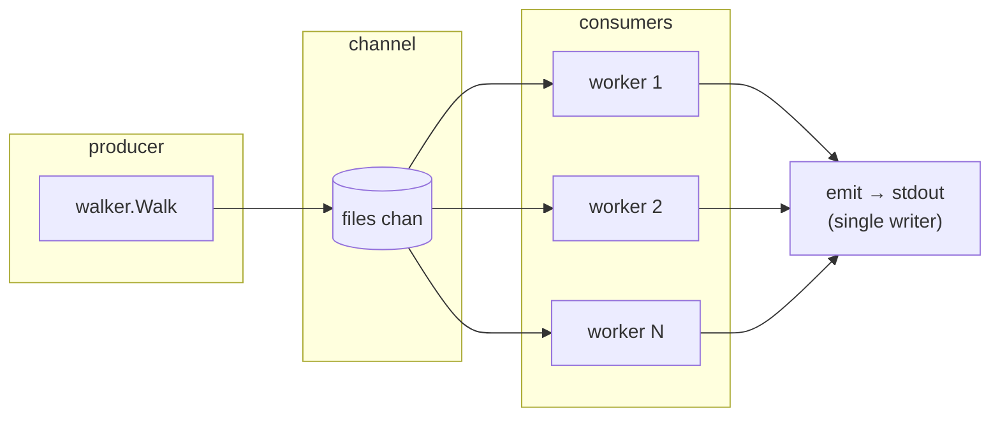
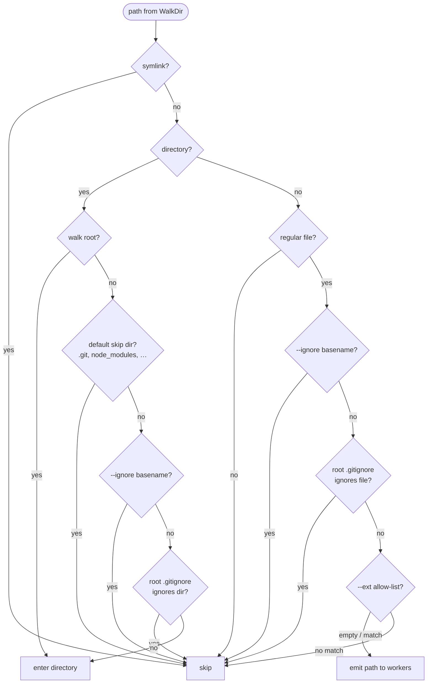
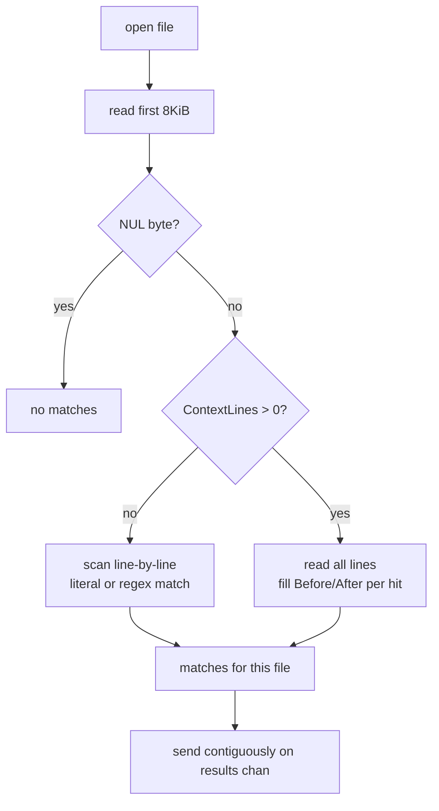

# fsearch

[](https://go.dev/dl/)
[](LICENSE)

Fast recursive file content search for the Linux shell.

Modern, concurrent alternative to classic `grep` / `find` combos.

> **Status:** Sprint 5 complete — polished docs, man page, `make install` to `~/.local/bin`, multi-OS install notes.

| | |
|--|--|
| **What** | Recursive keyword/regex search in file contents |
| **Like** | A concurrent, developer-friendly `grep -R` for source trees |
| **Primary OS** | Linux (macOS/Windows: best-effort via Go) |

## Contents

- [Quick start](#quick-start)
- [Requirements](#requirements) · [Build](#build) · [Install](#install)
- [Usage](#usage) · [Flags](#flags) · [Output format](#output-format)
- [Known limitations](#known-limitations)
- [Develop](#develop) · [Project structure](#project-structure)
- [Architecture](#architecture) · [Path filtering](#path-filtering) · [Per-file scan](#per-file-scan)
- [Docs](#docs)

## Quick start

```bash
make build
./bin/fsearch "TODO" . --ext go,md -C 1 -i
```

That builds the binary, then searches for `TODO` under the current directory (Go and Markdown only, one line of context, case-insensitive).

See [Install](#install) and [Usage](#usage) for more options.

## Requirements

| | |
|--|--|
| **Go** | 1.25+ (`go.mod`; tested with Go 1.26) |
| **Linux** | Primary — `make install`, man page, full docs |
| **macOS / Windows** | Best-effort — portable Go binary; packaging is Linux-first |

## Build

```bash
make build
# or
go build -o bin/fsearch ./cmd/fsearch
```

## Install

| You have… | Do this |
|-----------|---------|
| Linux + clone | `make install` → `~/.local/bin` (+ PATH helper) |
| Any OS + Go module | `go install github.com/nick/fsearch/cmd/fsearch@latest` |
| Built binary only | Copy to a dir on `PATH` (e.g. `~/.local/bin`) |
| macOS (zsh) | Prefer `go install`; put Go bin on `PATH` in `~/.zshrc` if needed |
| Windows | `go install` or `go build -o fsearch.exe .\cmd\fsearch` |

### Linux (recommended)

#### From module (no clone)

```bash
go install github.com/nick/fsearch/cmd/fsearch@latest
```

Ensure the install directory is on your `PATH`:

```bash
# Default install location is $(go env GOPATH)/bin, unless GOBIN is set
export PATH="$(go env GOPATH)/bin:$PATH"
# or, if you set GOBIN:
# export PATH="$(go env GOBIN):$PATH"

fsearch --help
```

#### From a local clone

```bash
make install
```

`make install` runs [`scripts/install.sh`](scripts/install.sh), which:

1. builds `fsearch` into `~/.local/bin/fsearch`
2. if `~/.local/bin` is not already on your `PATH`, adds it once to `~/.bashrc`

If the script asks you to reload the shell:

```bash
source ~/.bashrc
fsearch --help
```

#### Copy a built binary

```bash
make build
sudo cp bin/fsearch /usr/local/bin/
# or without sudo (same layout as make install):
cp bin/fsearch ~/.local/bin/
```

### macOS (best-effort)

The binary is normal Go — build or install with the Go toolchain. Prefer `go install` (works with bash or zsh):

```bash
go install github.com/nick/fsearch/cmd/fsearch@latest

# Put Go's bin dir on PATH if needed (GOBIN if set, else GOPATH/bin)
export PATH="$(go env GOPATH)/bin:$PATH"
# or: export PATH="$(go env GOBIN):$PATH"

fsearch --help
```

From a clone:

```bash
go install ./cmd/fsearch
# or
go build -o bin/fsearch ./cmd/fsearch
./bin/fsearch --help
```

Note: `make install` may work if Make, bash, and Go are available, but its PATH helper only edits `~/.bashrc`. On macOS the default shell is often **zsh** — add Go’s bin dir (or `~/.local/bin`) to `~/.zshrc` yourself if `fsearch` is not found.

### Windows (best-effort)

Not a first-class target, but you can install with Go (PowerShell or cmd):

```powershell
go install github.com/nick/fsearch/cmd/fsearch@latest
```

Ensure Go’s bin directory is on your user `PATH` (typically `%USERPROFILE%\go\bin`, or the path from `go env GOPATH` + `\bin`, or `go env GOBIN` if set). Then open a new terminal and run:

```powershell
fsearch --help
```

From a clone:

```powershell
go build -o fsearch.exe .\cmd\fsearch
.\fsearch.exe --help
```

Caveats: no Windows install script; path separators and `.gitignore` matching may differ slightly from Linux; man page is for Unix-style `man`.

## Usage

### Basics

```bash
fsearch --help

# Search for a keyword under the current directory
./bin/fsearch "TODO" .

# Everyday combo: extensions, context, case-insensitive
./bin/fsearch "TODO" . --ext go,md -C 1 -i
```

### Filter files

```bash
# Only Go and Markdown files
./bin/fsearch "TODO" . --ext go,md

# Extra basename ignores (repeatable)
./bin/fsearch "FIXME" ./internal --ignore vendor --ignore '*.min.js'

# Skip loading root .gitignore (built-in skips and --ignore still apply)
./bin/fsearch "TODO" . --no-gitignore
```

Root `.gitignore` is loaded automatically when present (root file only; MVP rule subset — see [Known limitations](#known-limitations)).

### Match options

```bash
# Case-insensitive
./bin/fsearch "todo" . -i

# One line of context before/after each hit
./bin/fsearch "TODO" . --ext go -C 1

# Regex (Go RE2); combine with -i for case-insensitive patterns
./bin/fsearch 'TODO|FIXME' . --ext go -e
./bin/fsearch 'todo' . -e -i
```

### Output & speed

```bash
# Force plain text (also automatic when piped / NO_COLOR)
./bin/fsearch "TODO" . --no-color

# NDJSON (one JSON object per match; good for pipes / jq)
./bin/fsearch "TODO" . --ext go --json
./bin/fsearch "TODO" . --ext go -C 1 --json

# Disable stderr progress (also off when stderr is not a TTY or with --json)
./bin/fsearch "TODO" . --no-progress

# Limit concurrent file-search workers (0 = NumCPU)
./bin/fsearch "TODO" . --workers 4
```

### Output format

Hits are grep-style: `path:line:content`

With context (`-C N`):

```
path-line-before
path:line:hit content
path-line-after
--
path:line:next hit
```

Overlapping or adjacent context groups on the same file are coalesced (no
duplicate lines, no mid-group `--`), like grep.

| Mode | Behavior |
|------|----------|
| **TTY colors** | Path magenta, line green, keyword/regex span bold red (hit lines only) |
| **No color** | Piped, `NO_COLOR`, or `--no-color` |
| **JSON** | `--json`: one NDJSON object per match; no ANSI; no `--` coalescing |
| **Progress** | stderr TTY: `fsearch: N files, M matches` (off with `--json` / `--no-progress`) |
| **Errors** | Unreadable paths skipped; `fsearch: skip <path>: …` on stderr |

**JSON shape:**

```json
{"path":"main.go","line":3,"content":"// TODO here"}
{"path":"a.txt","line":2,"content":"HIT","before":["before"],"after":["after"]}
```

`before` / `after` are omitted when empty. Context from `-C` is still included
on each object when present.

## Flags

| Flag | Meaning |
|------|---------|
| `--ext go,md` | only these extensions (empty = all) |
| `--ignore PAT` | skip basenames matching PAT (exact or glob; repeatable) |
| `-i`, `--ignore-case` | case-insensitive search (default: case-sensitive) |
| `-C`, `--context N` | N lines of context before and after each match |
| `-e`, `--regex` | treat keyword as a Go RE2 regular expression |
| `--json` | emit one NDJSON object per match on stdout |
| `--workers N` | concurrent file-search workers (`0` = `NumCPU`, default) |
| `--no-gitignore` | do not load root `.gitignore` |
| `--no-color` | disable colored output |
| `--no-progress` | disable progress indicator on stderr |

## Known limitations

| Topic | Detail |
|-------|--------|
| **`.gitignore`** | Root file only (no nested). MVP rules: `#`, `!`, trailing `/`, leading `/`, basic `filepath.Match` globs — not full git (`**`, etc.) |
| **Built-in skips** | Always prune common junk dirs (`.git`, `node_modules`, `vendor`, `bin`, …); not disabled by `--no-gitignore` |
| **Match order** | Across files: unsorted (worker finish order). Within a file: line order, contiguous for context |
| **Binary** | NUL in first 8KiB → file skipped |

## Develop

| Target | Purpose |
|--------|---------|
| `make build` | Build `bin/fsearch` |
| `make install` | Install to `~/.local/bin` (+ PATH helper) |
| `make test` | `go test ./... -v` |
| `make cover` | Coverage |
| `make bench` | Searcher benchmarks (`BENCH=…`, `BENCHTIME=…`) |
| `make man` | View `docs/fsearch.1` |
| `make clean` | Remove `bin/` |

```bash
make test
make cover
make bench
make clean
```

### Benchmarks (sample)

Fixture (built once per benchmark): **50** `.go` files × **200** lines, a `TODO` hit every 20th line.

Sample run (`make bench`, Go test `-benchmem -benchtime=1s` on linux/amd64, Intel i5-1335U):

| Benchmark | ns/op | B/op | allocs/op |
|-----------|------:|-----:|----------:|
| `BenchmarkSearch` | ~1.84ms | ~3.6 MiB | ~10.7k |
| `BenchmarkSearchWithContext` (`-C 1`) | ~2.43ms | ~4.1 MiB | ~12.0k |

Numbers vary by CPU, GOMAXPROCS, and load. Re-run with `make bench` for local results. Raw example:

```text
BenchmarkSearch-12                 739   1837607 ns/op  3621331 B/op  10717 allocs/op
BenchmarkSearchWithContext-12      445   2426592 ns/op  4102694 B/op  12017 allocs/op
```

## Project structure

```
fsearch/
├── cmd/fsearch/
│   └── main.go              # Cobra CLI entrypoint (flags, args, Ctrl+C)
├── internal/
│   ├── searcher/            # Orchestrates walk + concurrent file matching
│   ├── walker/              # filepath.WalkDir → file path channel
│   ├── ignore/              # Extension allow-list + basename skip rules
│   └── output/              # Grep-style, colors, NDJSON
├── docs/
│   └── fsearch.1            # Man page (section 1)
├── scripts/
│   └── install.sh           # make install → ~/.local/bin + PATH helper
├── bin/                     # Built binary (make build)
├── Makefile
├── go.mod / go.sum
├── README.md
├── AGENTS.md                # Agent/dev rules
└── DEVELOPMENT_PLAN.md      # Sprint plan
```

| Package | Role |
|---------|------|
| `cmd/fsearch` | Parses CLI args/flags, wires options, streams matches to stdout |
| `internal/searcher` | Coordinates workers; opens files and finds keyword/regex hits by line |
| `internal/walker` | Walks the tree (skips symlinks); yields regular file paths |
| `internal/ignore` | Default dir skips (`.git`, `node_modules`, …) + `--ext` / `--ignore` |
| `internal/output` | Formats hits (context, colors, regex highlight, NDJSON) |

### Architecture

Packages stay small and one-way: the CLI depends on `searcher` and `output`; `searcher` depends on `walker` and `ignore`. Nothing under `internal/` imports `cmd/`.



### Search data flow

A single invocation walks the tree once, fans file paths out to N workers (default: CPU count), and prints matches as they arrive (order is not guaranteed).


### Concurrency model



1. **Producer** — one goroutine walks the tree and pushes paths into a buffered channel.
2. **Consumers** — `Workers` (or `runtime.NumCPU()`) goroutines read paths, scan file contents, and emit matches.
3. **Cancel** — `context` from Ctrl+C stops the walk and workers via `errgroup`.
4. **Emit** — a single consumer goroutine writes matches to stdout (line-safe without a mutex).

### Path filtering

During the walk, directories and files are decided by `internal/ignore` (defaults, `--ignore`, root `.gitignore`, then `--ext` for files):



### Per-file scan

Each worker opens a path, skips obvious binaries, then either streams lines or buffers the file when `-C` needs context:



## Docs

- [AGENTS.md](AGENTS.md) — agent/dev rules
- [DEVELOPMENT_PLAN.md](DEVELOPMENT_PLAN.md) — sprint plan
- [docs/fsearch.1](docs/fsearch.1) — man page (section 1)

View the man page from a clone:

```bash
make man
# or: man ./docs/fsearch.1
```
