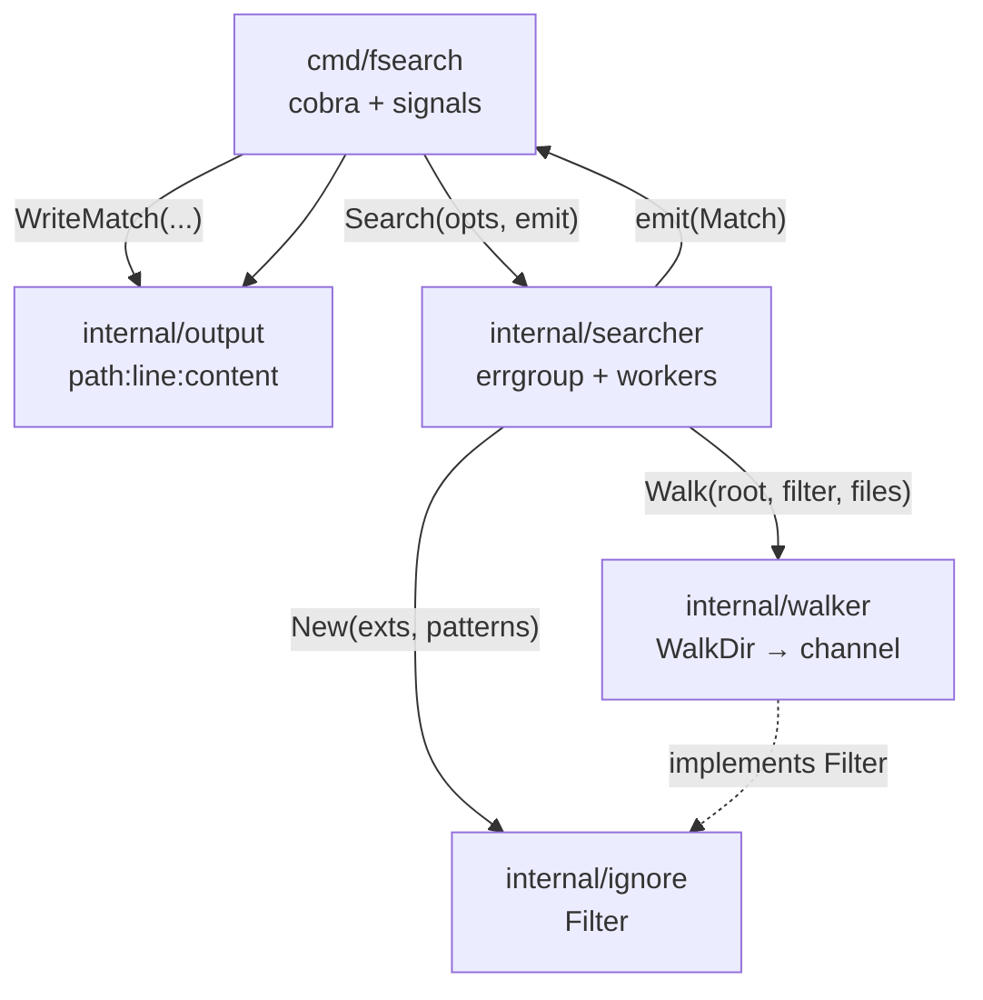
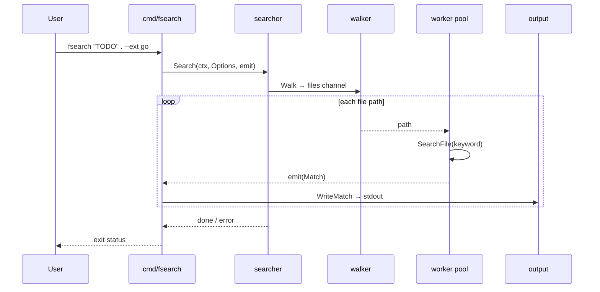
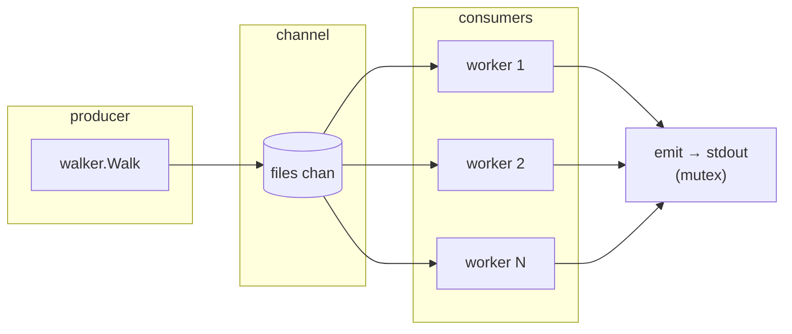

# fsearch

Fast recursive file content search for the Linux shell.

Modern, concurrent alternative to classic `grep` / `find` combos.

> **Status:** Sprint 1 — core search works. Color/pretty output lands in Sprint 2.

## Requirements

- Go 1.22+ (tested with Go 1.26)
- Linux

## Build

```bash
make build
# or
go build -o bin/fsearch ./cmd/fsearch
```

## Install

```bash
make install
# or
go install ./cmd/fsearch
```

## Usage

```bash
fsearch --help

# Search for a keyword under the current directory
./bin/fsearch "TODO" .

# Only Go and Markdown files
./bin/fsearch "TODO" . --ext go,md

# Extra basename ignores (repeatable)
./bin/fsearch "FIXME" ./internal --ignore vendor --ignore '*.min.js'
```

Output is grep-style: `path:line:content`

| Flag | Meaning |
|------|---------|
| `--ext go,md` | only these extensions (empty = all) |
| `--ignore PAT` | skip basenames matching PAT (exact or glob; repeatable) |

## Develop

```bash
make test
make cover
make clean
```

## Project structure

```
fsearch/
├── cmd/fsearch/
│   └── main.go              # Cobra CLI entrypoint (flags, args, Ctrl+C)
├── internal/
│   ├── searcher/            # Orchestrates walk + concurrent file matching
│   ├── walker/              # filepath.WalkDir → file path channel
│   ├── ignore/              # Extension allow-list + basename skip rules
│   └── output/              # Grep-style result formatting
├── bin/                     # Built binary (make build)
├── Makefile
├── go.mod / go.sum
├── README.md
├── AGENTS.md                # Agent/dev rules
└── DEVELOPMENT_PLAN.md      # Sprint plan
```

| Package | Role |
|---------|------|
| `cmd/fsearch` | Parses CLI args/flags, wires options, streams matches to stdout |
| `internal/searcher` | Coordinates workers; opens files and finds keyword hits by line |
| `internal/walker` | Walks the tree (skips symlinks); yields regular file paths |
| `internal/ignore` | Default dir skips (`.git`, `node_modules`, …) + `--ext` / `--ignore` |
| `internal/output` | Formats each hit as `path:line:content` |

### Architecture

Packages stay small and one-way: the CLI depends on `searcher` and `output`; `searcher` depends on `walker` and `ignore`. Nothing under `internal/` imports `cmd/`.



### Search data flow

A single invocation walks the tree once, fans file paths out to N workers (default: CPU count), and prints matches as they arrive (order is not guaranteed).



### Concurrency model



1. **Producer** — one goroutine walks the tree and pushes paths into a buffered channel.
2. **Consumers** — `Workers` (or `runtime.NumCPU()`) goroutines read paths, scan file contents, and emit matches.
3. **Cancel** — `context` from Ctrl+C stops the walk and workers via `errgroup`.
4. **Emit** — match callbacks are serialized with a mutex so stdout stays line-safe.

## Docs

- [AGENTS.md](AGENTS.md) — agent/dev rules
- [DEVELOPMENT_PLAN.md](DEVELOPMENT_PLAN.md) — sprint plan
