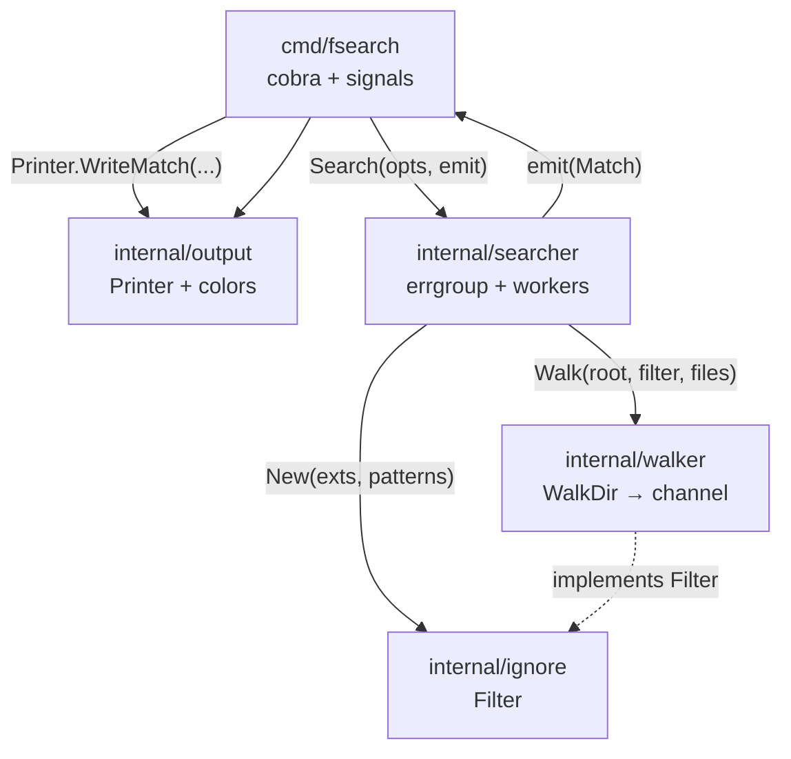
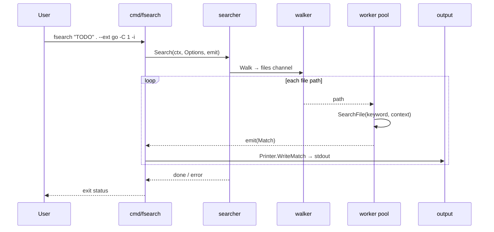
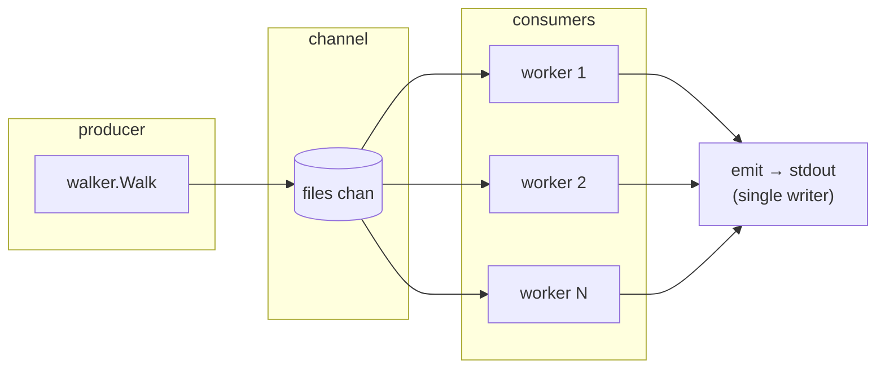

# fsearch

Fast recursive file content search for the Linux shell.

Modern, concurrent alternative to classic `grep` / `find` combos.

> **Status:** Sprint 3 — `.gitignore`, `--workers`, benchmarks, walk skip warnings.

## Requirements

- Go 1.22+ (tested with Go 1.26)
- Linux

## Build

```bash
make build
# or
go build -o bin/fsearch ./cmd/fsearch
```

## Install

```bash
make install
# or
go install ./cmd/fsearch
```

## Usage

```bash
fsearch --help

# Search for a keyword under the current directory
./bin/fsearch "TODO" .

# Only Go and Markdown files
./bin/fsearch "TODO" . --ext go,md

# Extra basename ignores (repeatable)
./bin/fsearch "FIXME" ./internal --ignore vendor --ignore '*.min.js'

# Case-insensitive
./bin/fsearch "todo" . -i

# One line of context before/after each hit
./bin/fsearch "TODO" . --ext go -C 1

# Combined
./bin/fsearch "TODO" . --ext go,md -C 1 -i

# Force plain text (also automatic when piped / NO_COLOR)
./bin/fsearch "TODO" . --no-color

# Skip loading root .gitignore (built-in skips and --ignore still apply)
./bin/fsearch "TODO" . --no-gitignore
```

Root `.gitignore` is loaded automatically when present (MVP subset of git rules).

### Output format

Hits are grep-style: `path:line:content`

With context (`-C N`):

```
path-line-before
path:line:hit content
path-line-after
--
path:line:next hit
```

Overlapping or adjacent context groups on the same file are coalesced (no
duplicate lines, no mid-group `--`), like grep.

On a TTY, path is magenta, line numbers green, and the keyword bold red on hit lines. Colors are off when piped, when `NO_COLOR` is set, or with `--no-color`.

Unreadable paths during walk or file open are skipped; a warning goes to stderr
(`fsearch: skip <path>: …`) and the search continues.

| Flag | Meaning |
|------|---------|
| `--ext go,md` | only these extensions (empty = all) |
| `--ignore PAT` | skip basenames matching PAT (exact or glob; repeatable) |
| `-i`, `--ignore-case` | case-insensitive search (default: case-sensitive) |
| `-C`, `--context N` | N lines of context before and after each match |
| `--workers N` | concurrent file-search workers (`0` = `NumCPU`, default) |
| `--no-gitignore` | do not load root `.gitignore` |
| `--no-color` | disable colored output |

## Develop

```bash
make test
make cover
make bench          # searcher benchmarks (override: BENCH=BenchmarkSearch BENCHTIME=2s)
make clean
```

### Benchmarks (sample)

Fixture (built once per benchmark): **50** `.go` files × **200** lines, a `TODO` hit every 20th line.

Sample run (`make bench`, Go test `-benchmem -benchtime=1s` on linux/amd64, Intel i5-1335U):

| Benchmark | ns/op | B/op | allocs/op |
|-----------|------:|-----:|----------:|
| `BenchmarkSearch` | ~1.55ms | ~3.6 MiB | ~10.7k |
| `BenchmarkSearchWithContext` (`-C 1`) | ~2.03ms | ~4.1 MiB | ~12.0k |

Numbers vary by CPU, GOMAXPROCS, and load. Re-run with `make bench` for local results. Raw example:

```text
BenchmarkSearch-12                 687   1545096 ns/op  3619564 B/op  10663 allocs/op
BenchmarkSearchWithContext-12      574   2028908 ns/op  4100741 B/op  11963 allocs/op
```

## Project structure

```
fsearch/
├── cmd/fsearch/
│   └── main.go              # Cobra CLI entrypoint (flags, args, Ctrl+C)
├── internal/
│   ├── searcher/            # Orchestrates walk + concurrent file matching
│   ├── walker/              # filepath.WalkDir → file path channel
│   ├── ignore/              # Extension allow-list + basename skip rules
│   └── output/              # Grep-style + colored formatting
├── bin/                     # Built binary (make build)
├── Makefile
├── go.mod / go.sum
├── README.md
├── AGENTS.md                # Agent/dev rules
└── DEVELOPMENT_PLAN.md      # Sprint plan
```

| Package | Role |
|---------|------|
| `cmd/fsearch` | Parses CLI args/flags, wires options, streams matches to stdout |
| `internal/searcher` | Coordinates workers; opens files and finds keyword hits by line |
| `internal/walker` | Walks the tree (skips symlinks); yields regular file paths |
| `internal/ignore` | Default dir skips (`.git`, `node_modules`, …) + `--ext` / `--ignore` |
| `internal/output` | Formats hits (context, colors, keyword highlight) |

### Architecture

Packages stay small and one-way: the CLI depends on `searcher` and `output`; `searcher` depends on `walker` and `ignore`. Nothing under `internal/` imports `cmd/`.



### Search data flow

A single invocation walks the tree once, fans file paths out to N workers (default: CPU count), and prints matches as they arrive (order is not guaranteed).



### Concurrency model



1. **Producer** — one goroutine walks the tree and pushes paths into a buffered channel.
2. **Consumers** — `Workers` (or `runtime.NumCPU()`) goroutines read paths, scan file contents, and emit matches.
3. **Cancel** — `context` from Ctrl+C stops the walk and workers via `errgroup`.
4. **Emit** — a single consumer goroutine writes matches to stdout (line-safe without a mutex).

## Docs

- [AGENTS.md](AGENTS.md) — agent/dev rules
- [DEVELOPMENT_PLAN.md](DEVELOPMENT_PLAN.md) — sprint plan
